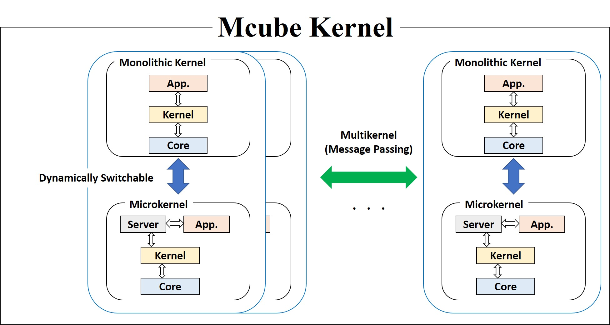

# Mcube Kernel
Operating System Supporting Dynamically Switchable Kernel Models

## Description
Mcube Kernel is an operating system for Micro/Monotlithic/MultiKernels.
Dynamically switchable kernel models can avoid unnecessary recompile and
reboot.



## Supporting Compilers and ISAs
- LLVM-6.0.0/GCC-7.3.0 (or later) for X86, ARM, and SIM (user-level) ISAs
- LLVM-6.0.0/GCC-4.8.4 Extension for AXIS ISA
  - LLVM's ISA name is MAXIS (can be downloaded from https://github.com/pflab-ut/llvm)
  - GCC's ISA name is DOM (not open for public)
- Python 3.6.5 (or later)


## Set up Build Environment (Ubuntu 18.04 LTS)

Please execute the following command (root privilege required).
```
$ make setup
```

## Set up Configuration

Please edit "configure" file.
Details of "configure" file are explained in "Kconfig".


## How to Build

First of all you check and modify "configure" file.
If "CONFIG_XXX=y", the configuration is enabled.
If "CONFIG_XXX=n", the configuration is disabled.
Then please execute the following command.

```
$ make configure
```

Please execute the following command.
```
$ make
```

If you would like to use "docker", please execute the following command.
```
$ make docker
```

Then, create "mcube" file in the top directory of "mcube".


If cleaning build files, please execute the following command.
```
$ make clean
```

## How to Execute

Please execute the following command in CUI.
```
$ make run
```

Please execute the following command in GUI.

```
$ make grun
```


## How to Test Configuration

Please set following environment variables for your e-mail address.

```
export EMAIL_FROM_ADDRESS=YOUR_EMAIL_FROM_ADDRESS
export EMAIL_TO_ADDRESS=YOUR_EMAIL_TO_ADDRESS
```

Please execute the following command.

```
$ make testconfig
```

After configuration test, send the results to your e-mail.

## Documentations
* [System](docs/System.md)
* [Misc](docs/Misc.md)
* [Acknowledgments](docs/Acknowledgments.md)


## License
- 2-clause BSD License
- See LICENSE

## Copyright
2018-2019 Hiroyuki Chishiro
